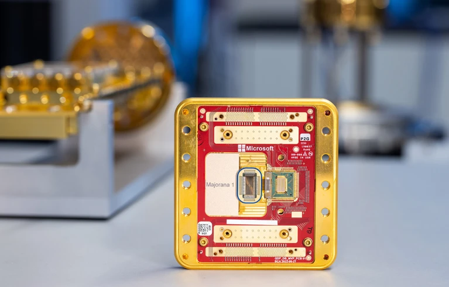

### Moore's Law on Trial

Picture this: a world where your phone outsmarts today’s supercomputers, all thanks to a tiny chip. For nearly 60 years, Moore’s Law; Gordon Moore’s 1965 prediction that transistor counts on chips would double every two years has been the heartbeat of this tech dream, shrinking devices and turbocharging their power. Today’s chips, at a jaw-dropping 5 nanometers (nm), are miracles of miniaturization, smaller than a virus. But as we push deeper into the quantum realm, cracks are showing. At these scales, quantum effects like electron tunneling and uncertainty threaten to scramble our calculations with errors.

James R. Powell, a nuclear engineering veteran who spent 40 years at Brookhaven National Laboratory before retiring in 1996, foresaw this crunch. He predicted Moore’s Law could sputter out by 2036, giving way to radical new tech like Quantum Dots (QD), Organic Semiconductors, Semiconductor Compounds, Perovskites, and Spintronics. These contenders promise to keep the innovation train rolling. But Microsoft’s betting big on a wildcard: quantum computing. Microsoft unveiled the Majorana 1 chip in February 2025, calling it the world’s first quantum processor powered by a **Topological Core**. They claim it uses **topological qubits**, a type of quantum bit built from **Majorana zero modes (MZMs)**; **exotic** **quasiparticles** that theoretically offer inherent stability against errors. Unlike traditional qubits (like those in Google’s or IBM’s systems), which are fragile and need tons of error correction, topological qubits are supposed to be robust because their quantum information is "braided" across space, making them less prone to noise.

But there is a backdraw I could say. As not all expects are clapping. Microsoft’s bold claims have sparked a firestorm of skepticism, echoing a 2021 debacle when a Microsoft-funded paper claiming Majorana particle discovery was retracted over data flaws.

### The Skeptical

Physicists are throwing shade. Vincent Mourik, who helped sink that 2018 paper, told Nature he doubts topological qubits will work at all, "At a fundamental level, the approach of building a quantum computer based on topological Majorana qubits as it is pursed by Microsoft is not going to work.". Others, like Georgios Katsaros from Institute of Science and Technology Austria in Klosterneuburg, said, "Without seeing the extra data from the qubit operation, there is not much one can comment".

Topological quantum computing is an innovative approach to building quantum computers that uses the unique properties of **anyons**[^1], which are special quasiparticles that exist in two-dimensional spaces.

[^1]: **Anyons**, which exist only in two-dimensional systems, have a unique property: when two anyons are swapped (or "braided"), the quantum state of the system depends on the specific path they took, not just their final arrangement. This path-dependent behavior is what makes anyons distinct from *traditional particles* and is the foundation of **topological quantum computing**.

**Traditional particles**[^2], anyons have an extraordinary trait: when two of them are swapped or "braided" around each other, the quantum state of the system changes in a way that depends on the specific path they take, not just their final positions. This process, called **braiding**, forms the basis for performing quantum computations.

[^2]: I mean, the standard elementary particles in physics, such as electrons, protons, and photons, which follow the well-established principles of quantum mechanics and quantum statistics.\
    \
    These particles obey either **Fermi-Dirac statistics** (fermions, like electrons) or **Bose-Einstein statistics** (bosons, like photons).

    Their behavior is determined only by their final positions after an exchange, not by the specific path taken during the exchange.

In this method, quantum information is stored in the global topological properties of the system. Think of it as encoding data in the overall "shape" or pattern of the system, similar to how a knot's structure defines it, rather than in fragile, local details. Topology, a field of mathematics, studies properties that stay the same even when objects are stretched or bent (but not torn or glued), and this stability is key. By relying on these global properties, topological quantum computing becomes highly robust against errors. Local disturbances, like noise or interference, don’t easily disrupt the system, making it less prone to the decoherence and errors that challenge other quantum computing approaches.

 

$$\cdot~\cdot~\cdot$$
